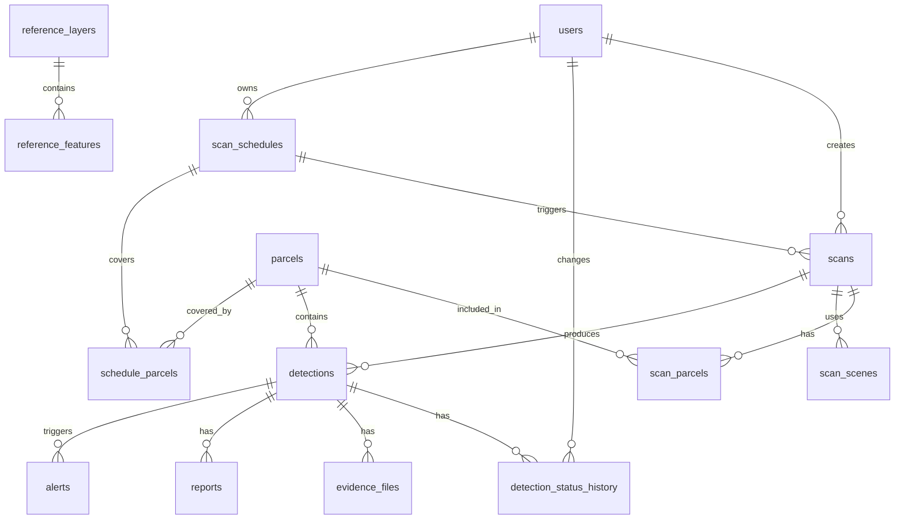

# GeoGuard-EO — Database Schema

> PostgreSQL 15 + PostGIS 3.x. All geometries stored in **EPSG:4326** (`geometry(..., 4326)`). Area is computed with `ST_Area(geom::geography)` or in a projected CRS in the pipeline, never in degrees.
> All schema changes go through **Alembic migrations**. Never edit tables by hand.

---

## 1. Entity Relationship Overview



## 2. Setup

```sql
CREATE EXTENSION IF NOT EXISTS postgis;
CREATE EXTENSION IF NOT EXISTS pgcrypto;   -- gen_random_uuid()
```

## 3. Enumerations

```sql
CREATE TYPE user_role        AS ENUM ('admin', 'officer');
CREATE TYPE scan_status      AS ENUM ('queued', 'running', 'succeeded', 'failed', 'cancelled');
CREATE TYPE detection_status AS ENUM ('new', 'confirmed', 'dismissed', 'field_visit');
CREATE TYPE confidence_class AS ENUM ('high', 'medium', 'low');
CREATE TYPE sensor_type      AS ENUM ('sentinel1', 'sentinel2');
CREATE TYPE period_type      AS ENUM ('baseline', 'current');
CREATE TYPE evidence_kind    AS ENUM ('before_rgb', 'after_rgb', 'change_map', 'overview');
CREATE TYPE alert_status     AS ENUM ('pending', 'sent', 'failed');
```

## 4. Tables

### 4.1 `users`
```sql
CREATE TABLE users (
    id            UUID PRIMARY KEY DEFAULT gen_random_uuid(),
    email         TEXT NOT NULL UNIQUE,
    full_name     TEXT NOT NULL,
    password_hash TEXT NOT NULL,
    role          user_role NOT NULL DEFAULT 'officer',
    is_active     BOOLEAN NOT NULL DEFAULT TRUE,
    telegram_chat_id TEXT,                     -- optional, for free Telegram alerts
    must_change_password BOOLEAN NOT NULL DEFAULT FALSE,
    created_at    TIMESTAMPTZ NOT NULL DEFAULT now(),
    updated_at    TIMESTAMPTZ NOT NULL DEFAULT now()
);
```

### 4.2 `parcels` (protected land)
```sql
CREATE TABLE parcels (
    id          UUID PRIMARY KEY DEFAULT gen_random_uuid(),
    name        TEXT NOT NULL,
    category    TEXT NOT NULL,                 -- e.g. 'riverbed','wetland','government_plot','forest'
    notes       TEXT,
    geom        geometry(MultiPolygon, 4326) NOT NULL,
    area_m2     DOUBLE PRECISION NOT NULL,     -- computed on insert via geography
    source      TEXT NOT NULL DEFAULT 'upload' CHECK (source IN ('upload','drawn')),
    source_ref  TEXT,                          -- original file/feature id
    created_by  UUID REFERENCES users(id) ON DELETE SET NULL,
    created_at  TIMESTAMPTZ NOT NULL DEFAULT now(),
    updated_at  TIMESTAMPTZ NOT NULL DEFAULT now(),
    CONSTRAINT parcels_valid_geom CHECK (ST_IsValid(geom))
);
CREATE INDEX idx_parcels_geom ON parcels USING GIST (geom);
```

### 4.3 `scans`
```sql
CREATE TABLE scans (
    id                UUID PRIMARY KEY DEFAULT gen_random_uuid(),
    status            scan_status NOT NULL DEFAULT 'queued',
    step              TEXT,                    -- current pipeline step key
    progress          SMALLINT NOT NULL DEFAULT 0 CHECK (progress BETWEEN 0 AND 100),
    message           TEXT,                    -- human-readable status / error reason
    error_code        TEXT,
    baseline_start    DATE NOT NULL,
    baseline_end      DATE NOT NULL,
    current_start     DATE NOT NULL,
    current_end       DATE NOT NULL,
    params            JSONB NOT NULL,          -- thresholds, cloud max, min area, fusion weights
    algorithm_version TEXT NOT NULL,           -- e.g. 'idx-fusion-1.0.0'
    aoi_geom          geometry(Polygon, 4326), -- processed bbox
    rerun_of          UUID REFERENCES scans(id) ON DELETE SET NULL,
    schedule_id       UUID,                    -- set when created by a schedule; FK added in 4.12
    created_by        UUID REFERENCES users(id) ON DELETE SET NULL,
    created_at        TIMESTAMPTZ NOT NULL DEFAULT now(),
    started_at        TIMESTAMPTZ,
    finished_at       TIMESTAMPTZ,
    CONSTRAINT scans_periods_ok CHECK (baseline_start <= baseline_end AND current_start <= current_end AND baseline_end < current_start)
);
CREATE INDEX idx_scans_status_created ON scans (status, created_at DESC);
```

### 4.4 `scan_parcels` (many-to-many)
```sql
CREATE TABLE scan_parcels (
    scan_id   UUID NOT NULL REFERENCES scans(id)   ON DELETE CASCADE,
    parcel_id UUID NOT NULL REFERENCES parcels(id) ON DELETE RESTRICT,
    PRIMARY KEY (scan_id, parcel_id)
);
```

### 4.5 `scan_scenes` (which satellite scenes were used)
```sql
CREATE TABLE scan_scenes (
    id            UUID PRIMARY KEY DEFAULT gen_random_uuid(),
    scan_id       UUID NOT NULL REFERENCES scans(id) ON DELETE CASCADE,
    sensor        sensor_type NOT NULL,
    period        period_type NOT NULL,
    scene_id      TEXT NOT NULL,               -- provider's item id
    acquired_at   TIMESTAMPTZ NOT NULL,
    cloud_cover   REAL,                        -- optical only
    orbit         TEXT,                        -- radar orbit direction / relative orbit
    footprint     geometry(Polygon, 4326),
    meta          JSONB,
    UNIQUE (scan_id, sensor, period, scene_id)
);
CREATE INDEX idx_scan_scenes_scan ON scan_scenes (scan_id);
```

### 4.6 `detections`
```sql
CREATE TABLE detections (
    id                UUID PRIMARY KEY DEFAULT gen_random_uuid(),
    scan_id           UUID NOT NULL REFERENCES scans(id)   ON DELETE CASCADE,
    parcel_id         UUID NOT NULL REFERENCES parcels(id) ON DELETE RESTRICT,
    geom              geometry(MultiPolygon, 4326) NOT NULL,   -- clipped to parcel
    centroid          geometry(Point, 4326) NOT NULL,
    area_m2           DOUBLE PRECISION NOT NULL CHECK (area_m2 > 0),
    confidence        confidence_class NOT NULL,
    score             REAL NOT NULL CHECK (score BETWEEN 0 AND 1),
    optical_detected  BOOLEAN NOT NULL,
    radar_detected    BOOLEAN NOT NULL,
    d_bui_mean        REAL,                    -- mean optical change magnitude
    d_ndvi_mean       REAL,
    d_sigma_vv_mean   REAL,                    -- mean radar change in dB
    sar_overlap       REAL CHECK (sar_overlap BETWEEN 0 AND 1),
    status            detection_status NOT NULL DEFAULT 'new',
    status_note       TEXT,
    reviewed_by       UUID REFERENCES users(id) ON DELETE SET NULL,
    reviewed_at       TIMESTAMPTZ,
    matches_detection UUID REFERENCES detections(id) ON DELETE SET NULL, -- same site seen in earlier scan (v1.1)
    created_at        TIMESTAMPTZ NOT NULL DEFAULT now()
);
CREATE INDEX idx_detections_geom     ON detections USING GIST (geom);
CREATE INDEX idx_detections_centroid ON detections USING GIST (centroid);
CREATE INDEX idx_detections_scan     ON detections (scan_id);
CREATE INDEX idx_detections_parcel   ON detections (parcel_id);
CREATE INDEX idx_detections_filter   ON detections (status, confidence, created_at DESC);
```

### 4.7 `detection_status_history` (audit trail)
```sql
CREATE TABLE detection_status_history (
    id            UUID PRIMARY KEY DEFAULT gen_random_uuid(),
    detection_id  UUID NOT NULL REFERENCES detections(id) ON DELETE CASCADE,
    from_status   detection_status,
    to_status     detection_status NOT NULL,
    note          TEXT,
    reason_code   TEXT,                        -- e.g. 'bare_soil','cloud_shadow','seasonal','other'
    changed_by    UUID REFERENCES users(id) ON DELETE SET NULL,
    changed_at    TIMESTAMPTZ NOT NULL DEFAULT now()
);
CREATE INDEX idx_dsh_detection ON detection_status_history (detection_id, changed_at DESC);
```

### 4.8 `evidence_files`
```sql
CREATE TABLE evidence_files (
    id            UUID PRIMARY KEY DEFAULT gen_random_uuid(),
    detection_id  UUID NOT NULL REFERENCES detections(id) ON DELETE CASCADE,
    kind          evidence_kind NOT NULL,
    path          TEXT NOT NULL,               -- relative to DATA_DIR
    width_px      INTEGER,
    height_px     INTEGER,
    bounds        geometry(Polygon, 4326),     -- geographic extent of the image
    created_at    TIMESTAMPTZ NOT NULL DEFAULT now(),
    UNIQUE (detection_id, kind)
);
```

### 4.9 `reports`
```sql
CREATE TABLE reports (
    id            UUID PRIMARY KEY DEFAULT gen_random_uuid(),
    detection_id  UUID NOT NULL REFERENCES detections(id) ON DELETE CASCADE,
    path          TEXT NOT NULL,               -- relative to DATA_DIR
    generated_by  UUID REFERENCES users(id) ON DELETE SET NULL,
    generated_at  TIMESTAMPTZ NOT NULL DEFAULT now()
);
CREATE INDEX idx_reports_detection ON reports (detection_id, generated_at DESC);
```

### 4.10 `alerts`
```sql
CREATE TABLE alerts (
    id            UUID PRIMARY KEY DEFAULT gen_random_uuid(),
    detection_id  UUID NOT NULL REFERENCES detections(id) ON DELETE CASCADE,
    channel       TEXT NOT NULL DEFAULT 'console',   -- 'console' | 'telegram' | 'email'
    recipient     TEXT NOT NULL,
    provider      TEXT NOT NULL,               -- 'console', or a vendor key
    status        alert_status NOT NULL DEFAULT 'pending',
    attempts      SMALLINT NOT NULL DEFAULT 0,
    last_error    TEXT,
    created_at    TIMESTAMPTZ NOT NULL DEFAULT now(),
    sent_at       TIMESTAMPTZ
);
CREATE INDEX idx_alerts_detection ON alerts (detection_id);
```

### 4.11 `app_settings` (optional key-value)
```sql
CREATE TABLE app_settings (
    key        TEXT PRIMARY KEY,
    value      JSONB NOT NULL,
    updated_by UUID REFERENCES users(id) ON DELETE SET NULL,
    updated_at TIMESTAMPTZ NOT NULL DEFAULT now()
);
```

### 4.12 `scan_schedules` and `schedule_parcels`
```sql
CREATE TABLE scan_schedules (
    id                  UUID PRIMARY KEY DEFAULT gen_random_uuid(),
    name                TEXT NOT NULL,
    is_active           BOOLEAN NOT NULL DEFAULT TRUE,
    cron                TEXT NOT NULL,             -- e.g. '0 2 * * 1' (weekly, Monday 02:00)
    current_window_days INTEGER NOT NULL DEFAULT 30 CHECK (current_window_days BETWEEN 5 AND 120),
    baseline_rule       JSONB NOT NULL,            -- e.g. {"mode":"same_season_previous_year","window_days":30}
    params              JSONB NOT NULL,            -- same shape as scans.params
    last_run_at         TIMESTAMPTZ,
    next_run_at         TIMESTAMPTZ,
    created_by          UUID REFERENCES users(id) ON DELETE SET NULL,
    created_at          TIMESTAMPTZ NOT NULL DEFAULT now()
);

CREATE TABLE schedule_parcels (
    schedule_id UUID NOT NULL REFERENCES scan_schedules(id) ON DELETE CASCADE,
    parcel_id   UUID NOT NULL REFERENCES parcels(id) ON DELETE CASCADE,
    PRIMARY KEY (schedule_id, parcel_id)
);

ALTER TABLE scans
    ADD CONSTRAINT scans_schedule_fk
    FOREIGN KEY (schedule_id) REFERENCES scan_schedules(id) ON DELETE SET NULL;
```

## 5. Constraints and Integrity Rules

- Deleting a **parcel** is blocked (`RESTRICT`) while scans or detections reference it; the API offers an explicit admin cascade that removes them in a transaction.
- Deleting a **scan** cascades to its scenes, detections, evidence, reports, and alerts.
- `detections.parcel_id` must match a parcel that was part of the scan (enforced in the service layer; add a trigger later if needed).
- `updated_at` maintained by ORM events or a shared trigger.
- All timestamps are UTC (`timestamptz`).

## 6. Useful Query Patterns

```sql
-- Detections inside a bounding box (map view)
SELECT id, confidence, area_m2, ST_AsGeoJSON(geom)::json AS geometry
FROM detections
WHERE geom && ST_MakeEnvelope(:minx, :miny, :maxx, :maxy, 4326)
  AND status = 'new';

-- Clip a candidate polygon to a parcel and compute geodesic area
SELECT ST_Multi(ST_Intersection(:cand, p.geom)) AS geom,
       ST_Area(ST_Intersection(:cand, p.geom)::geography) AS area_m2
FROM parcels p
WHERE ST_Intersects(:cand, p.geom);

-- Match to a previously reviewed detection (overlap > 50% of the smaller area)
SELECT d_old.id
FROM detections d_old
WHERE ST_Intersects(d_old.geom, :new_geom)
  AND ST_Area(ST_Intersection(d_old.geom, :new_geom)::geography)
      > 0.5 * LEAST(d_old.area_m2, :new_area);
```

## 7. Migration and Seed Plan

1. `0001_init_extensions_enums`
2. `0002_users_parcels`
3. `0003_scans_scenes`
4. `0004_detections_history_evidence`
5. `0005_reports_alerts_settings`
6. `0006_scan_schedules`
7. `seed_sample.py` (not a migration): first admin from environment variables, plus optional sample parcels and a completed sample scan for onboarding.

## 8. Storage Layout (files)

```
data/
├── cache/                      # windowed raster cache
├── evidence/{scan_id}/{detection_id}/before.png, after.png, change.png
├── reports/{detection_id}/{report_id}.pdf
└── eval/                       # labeled evaluation GeoJSON
```

Paths in the database are always **relative to `DATA_DIR`**.


### 4.13 `reference_layers` and `reference_features` (Phase 9, migration 0007)

Protected / restricted boundaries supplied by the owner (wetland, water_body, forest, coastal, land_use, custom). Used only to compute **zone context** for detections at read time (decision D74); nothing is written back to `detections`.

| Column | Type | Notes |
|---|---|---|
| reference_layers.id | uuid pk | |
| name, kind | text | kind CHECK in the six values above |
| source, source_date, notes | text / date / text | cited in UI, PDF, e-mail |
| buffer_m | int 0–5000 | also flag detections within this distance |
| is_active | bool | inactive layers are ignored everywhere |
| feature_count | int | maintained on insert |
| created_by, created_at | | |
| reference_features.id | uuid pk | |
| layer_id | fk → reference_layers ON DELETE CASCADE | |
| name | text | best-effort from properties (name/NAME/title/…) |
| props | jsonb | scalar properties only |
| geom | geometry(MultiPolygon, 4326), GiST, ST_IsValid | |

Zone query (per detection): `ST_DWithin(det.geom::geography, feat.geom::geography, layer.buffer_m)`; inside fraction = `ST_Area(ST_Intersection(...)::geography) / ST_Area(det.geom::geography)`; distance = `ST_Distance(::geography)`.
